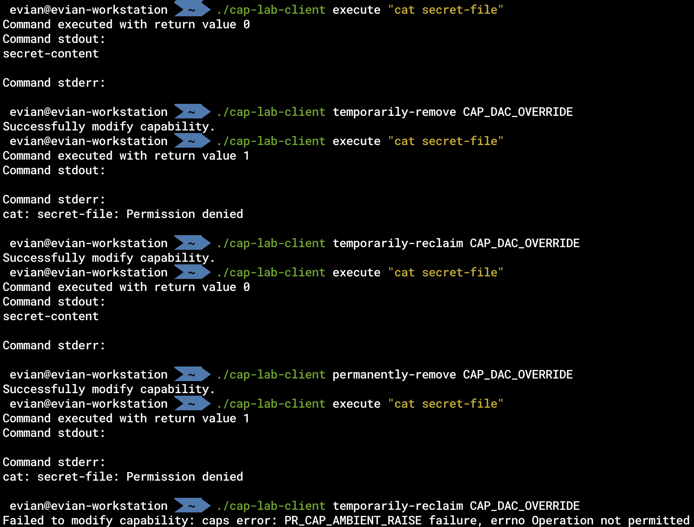

# 权能相关实验

## 架构简介

本项目由两个程序构成：`cap-lab-daemon`及`cap-lab-client`。

* `cap-lab-daemon`程序权能的Permitted集合包含大部分权能。
* `cap-lab-client`为命令行程序，读取用户的命令行输入，向daemon发送相应指令。真正控制子进程权能的为`cap-lab-daemon`
* `cap-lab-client`可以向`cap-lab-daemon`发送请求，让其创建子进程并让子进程执行某些命令，从而可以看出子进程是否具有相应能力。
* `cap-lab-client`可以向`cap-lab-daemon`发送请求，让其永久删除子进程的某个权能、暂时性删除子进程的某个权能、让被暂时性删除的权能重新获得。

## 效果展示

为了展示相应的效果，我们首先作如下准备：

* 创建一个`secret-file`文件，其内容为"secret-content"，其DAC权限只能由root用户读写，其他用户没有读写权限。
* 给`cap-lab-daemon`程序的Permitted集合、Inheritable集合、Ambient集合赋予`CAP_DAC_OVERRIDE`权能，方便后续展示。

随后，我们进行如下图操作，获得相应结果：



下面分别解释每一行指令及其结果的意义：

1. `./cap-lab-client execute "cat secret-file"`

   客户端向daemon发送请求，让其创建子进程执行`cat secret-file`命令。

   由于daemon具有`CAP_DAC_OVERRIDE`权能，能对任意文件进行读写，因此该指令执行正常，能正确读取相关文件内容。
2. `./cap-lab-client temporarily-remove CAP_DAC_OVERRIDE`

   客户端向daemon发送请求，让其暂时删除子进程的`CAP_DAC_OVERRIDE`权能。
3. `./cap-lab-client execute "cat secret-file"`

   客户端向daemon发送请求，让其创建子进程执行`cat secret-file`命令。

   由于子进程的`CAP_DAC_OVERRIDE`权能被暂时删除，因此读取失败，并报告Permission denied
4. `./cap-lab-client temporarily-reclaim CAP_DAC_OVERRIDE`

   客户端向daemon发送请求，让其恢复子进程被暂时删除的`CAP_DAC_OVERRIDE`权能。
5. `./cap-lab-client execute "cat secret-file"`

   客户端向daemon发送请求，让其创建子进程执行`cat secret-file`命令。

   由于子进程的`CAP_DAC_OVERRIDE`权能被恢复，因此读取成功
6. `./cap-lab-client permanently-remove CAP_DAC_OVERRIDE`

   客户端向daemon发送请求，让其永久删除子进程的`CAP_DAC_OVERRIDE`权能。
7. `./cap-lab-client execute "cat secret-file"`

   客户端向daemon发送请求，让其创建子进程执行`cat secret-file`命令。

   由于子进程的`CAP_DAC_OVERRIDE`权能被永久删除，因此读取失败，并报告Permission denied
8. `./cap-lab-client temporarily-reclaim CAP_DAC_OVERRIDE`

   客户端向daemon发送请求，让其恢复子进程的`CAP_DAC_OVERRIDE`权能。

   由于该权能被永久删除，因此无法恢复，报错。

## 原理解析

本项目使用Rust编写，其底层仍然使用的是`libcap`库。之所以使用Rust，是因为可以更方便地进行命令行选项分析、进程间交互、标准输出标准错误输出捕获等功能，与核心功能无关。接下来的原理解释，均用底层的C语言相关知识进行解释。

首先，当`cap-lab-daemon`程序运行时，我们首先要做的是将其Permitted集合中的权能赋予Inheritable和Ambient集合，从而使子进程能继承父进程的权能。赋予Inheritable集合权能的API为`cap_set_proc`，赋予Ambient集合权能的API为`prctl`系统调用，需要在第一个参数使用`PR_CAP_AMBIENT`从而读取或改变Ambient集合的权能。

当`cap-lab-daemon`收到客户端请求，执行一个命令时，其将采用`execve`指令执行。子进程将直接继承父进程Ambient集合的权能。

当`cap-lab-daemon`收到客户端请求，暂时性删除子进程的某个权能时，其首先使用`cap_from_text`将相应的权能字符串转换为内存中的变量，然后将该权能从Ambient集合中删除即可（这样子进程继承时就不会继承该权能），相关的API为`prctl`系统调用，与上述一致。

当`cap-lab-daemon`收到客户端请求，恢复子进程被暂时性删除的某个权能时，与上述操作相反，将其加入Ambient集合即可。

当`cap-lab-daemon`收到客户端请求，永久性删除子进程的某个权能时，其需要依次：

1. 删除Inheritable集合中相应的权能
2. 删除Effective集合中相应的权能
3. 删除Permitted集合中相应的权能

此顺序不可颠倒，否则会报错。删除上述集合中相应权能的方式为，先获得上述集合的所有权能，然后在内存中的集合删除相应权能，再将相应集合通过`cap_set_proc`命令进行设置。

总体而言，通过`execve`生成的子进程的权能应满足

```plaintext
P'(ambient)     = (file is privileged) ? 0 : P(ambient)

P'(permitted)   = (P(inheritable) & F(inheritable)) |
                  (F(permitted) & P(bounding)) | P'(ambient)

P'(effective)   = F(effective) ? P'(permitted) : P'(ambient)

P'(inheritable) = P(inheritable)    [i.e., unchanged]

P'(bounding)    = P(bounding)       [i.e., unchanged]
```

同时还需注意到，从Ambient集合中删除的权能可以被恢复，但从Permitted集合中删除的权能不能被恢复，就能实现暂时性删除和永久性删除的功能了。

